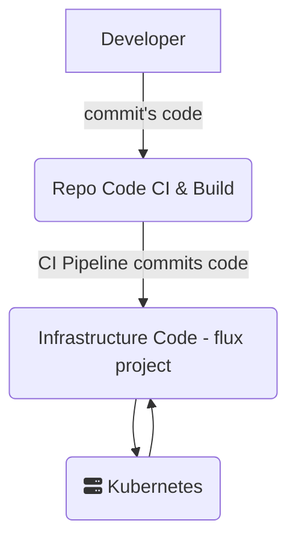

# Flux workflow diagram

```mermaid
flowchart TD
    A[Developer] -->|commit's code| B(Repo Code CI & Build)
    B -->|CI Pipeline commits code| C(Infrastructure Code - flux project)
    C --> D(fa:fa-server Kubernetes)
    D --> C
```
